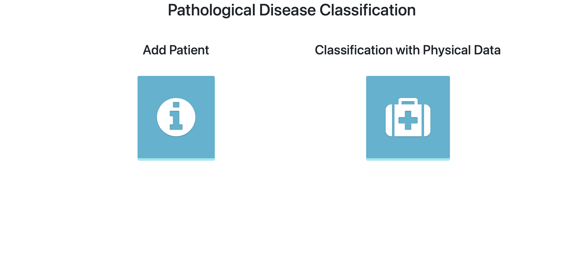
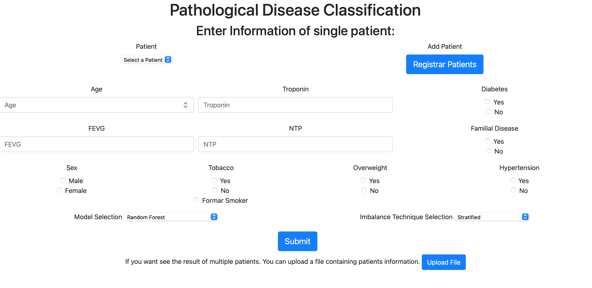
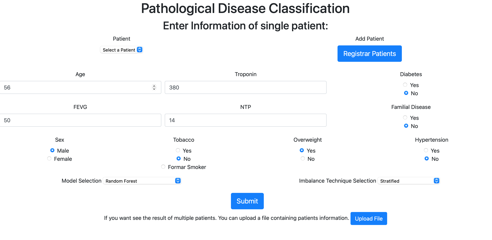
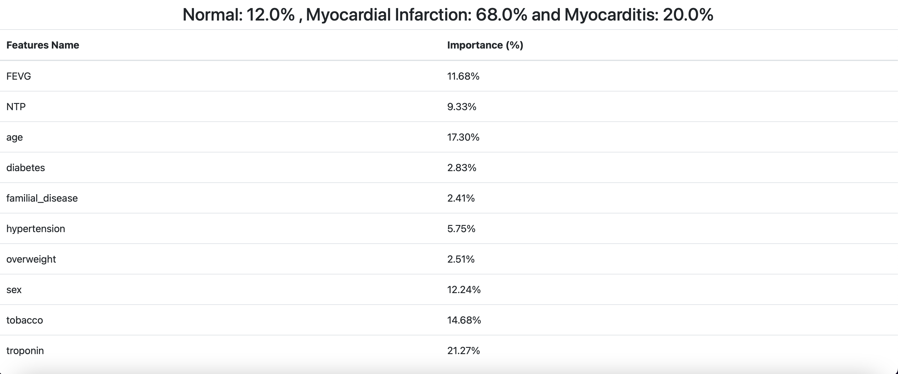

# Automatic Classification of Myocardial Infarction and Myocarditis
This repository hosts code for the project "Automatic Classification of Patients with Myocardial Infarction or Myocarditis Based Only on Clinical Data." The goal is to classify myocardial infarction and myocarditis using machine learning techniques applied to clinical data.

Project Structure
This is the backend server for handling data processing and model inference and the frontend interface for visualizing and interacting with predictions.

## Screenshots

### Main View

### Input View

### Sample Input View

### Prediction Result

## Citing This Work

If you use this code or data in your research, please cite the following paper:

> **Automatic Classification of Patients with Myocardial Infarction or Myocarditis Based Only on Clinical Data**  
> Authors: [Sheikh Shah Mohammad Motiur Rahman, Zhihao Chen, Alain Lalande ,Thomas Decourselle, Alexandre Cochet, Thibaut Pommier, Yves Cottin, Michel Salomon, Raphaël Couturier]  
> Journal: *PLOS ONE*  
> DOI: [10.1371/journal.pone.0285165](https://doi.org/10.1371/journal.pone.0285165)

